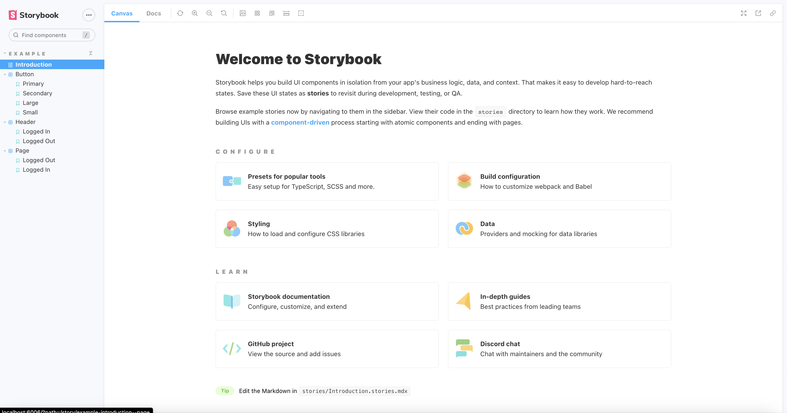

# React Storybook Crash Course

## Initializaing and running a storybook

 
1.  First of all create the react application (ex: `npx create-react-app react-storybook-tutorial --template typescript`)


2. Then, navigate to the root directory with CLI and execute following command to initialize the storybook 

    ```
    npx storybook init
    ```

    Or we can use shorthand code(`sb` stands for storybook).

    ```
    npx sb init
    ```


3. The above command execution will doenload all the storybook information into our application. The important thing is that we need to do this after initializing the application.


4. Initializing a storybook will create two new directories within the project.
    
    **4.1 `storybook`** : Contains two files. Those are `main.js` (which is like a config file) and `preview.js` (which allows us to set different global configurations)

    **4.2 `stories`** : This is where all the storybook related code is added.


5. Also, there will be some scripts added in `package.json` and an important one is `"storybook": "start-storybook -p 6006 -s public"`. With that we can start the storybook by executing the following command. (storybook will run on port 6006 as specified above).
    ```
    npm run storybook
    ```

6. By default there can be some storybooks generated such as `Introduction`, `Header`, `Page` and some component specific ones (if auto detected) within the `stories` directory. We can customize this directory as needed. Also it is recommended to put all the component specific storybooks inside `stories` directory. Folloeing figures represent the set of auto-generated stories initially (These were removed and customized the `stories` directory from the scratch later on) and initial view when the storybook was run.

<div>
    
    
</div>


## References

- React Storybook Crash Course (by WebDev Simplified): https://www.youtube.com/watch?v=FUKpWgRyPlU